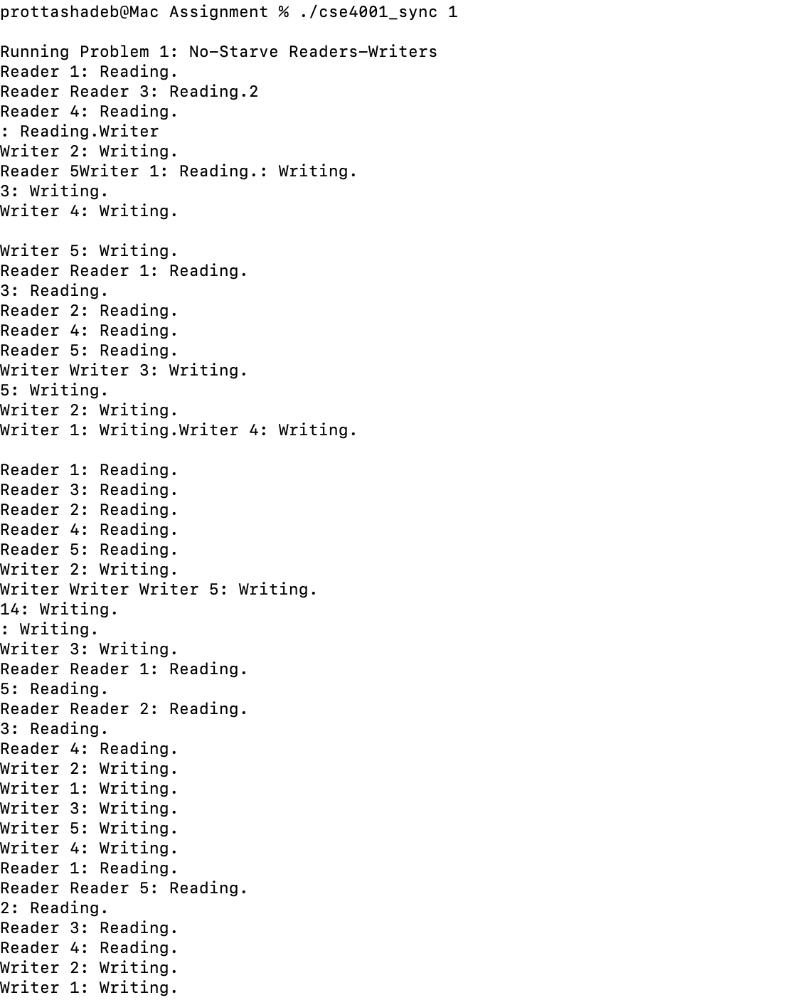
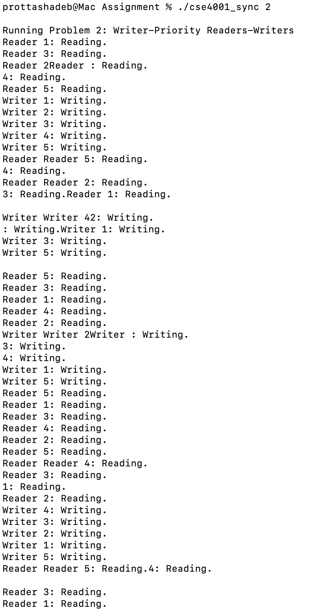
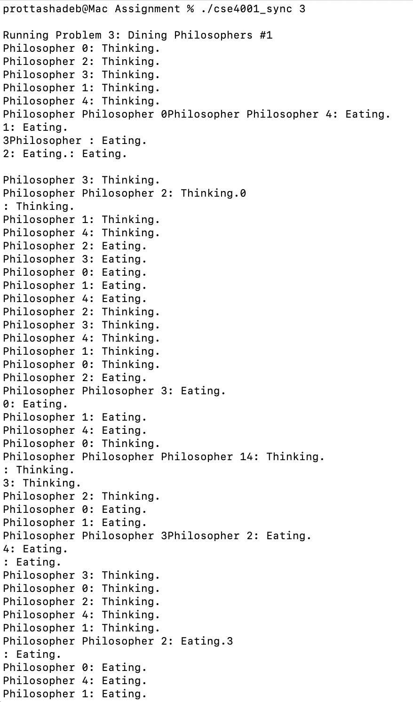
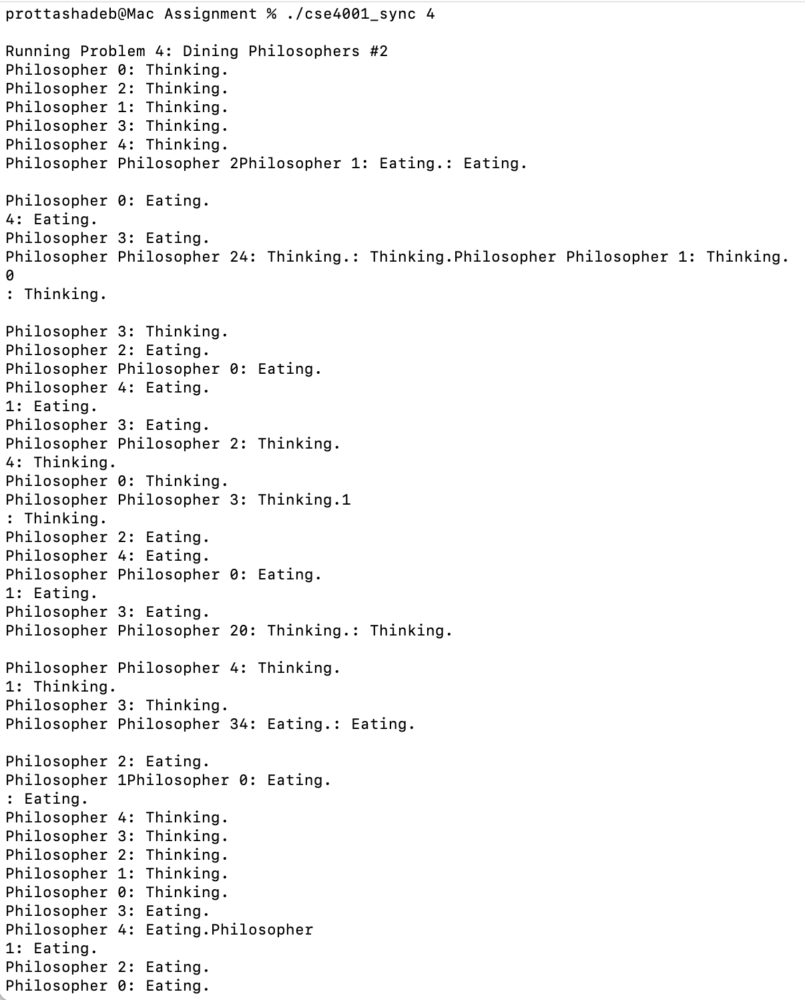

# Solution 1

Implements Downey’s “no starvation” algorithm using a reader’s lightswitch and a writer-controlled turnstile. Readers may enter together, writers enter one at a time, and neither group starves.

# Solution 2

Uses both a reader lightswitch and a writer lightswitch. Writers block the turnstile so new readers cannot enter, ensuring writers always get priority and never wait behind readers.

# Solution 3

Prevents deadlock by allowing only 4 philosophers to sit at the table at once. A “room” semaphore ensures at least one fork is always free, avoiding circular wait.

# Solution 4

Breaks circular wait by alternating fork-pickup order: odd philosophers take left fork first, even philosophers take right fork first. This guarantees at least one philosopher can always eat.
